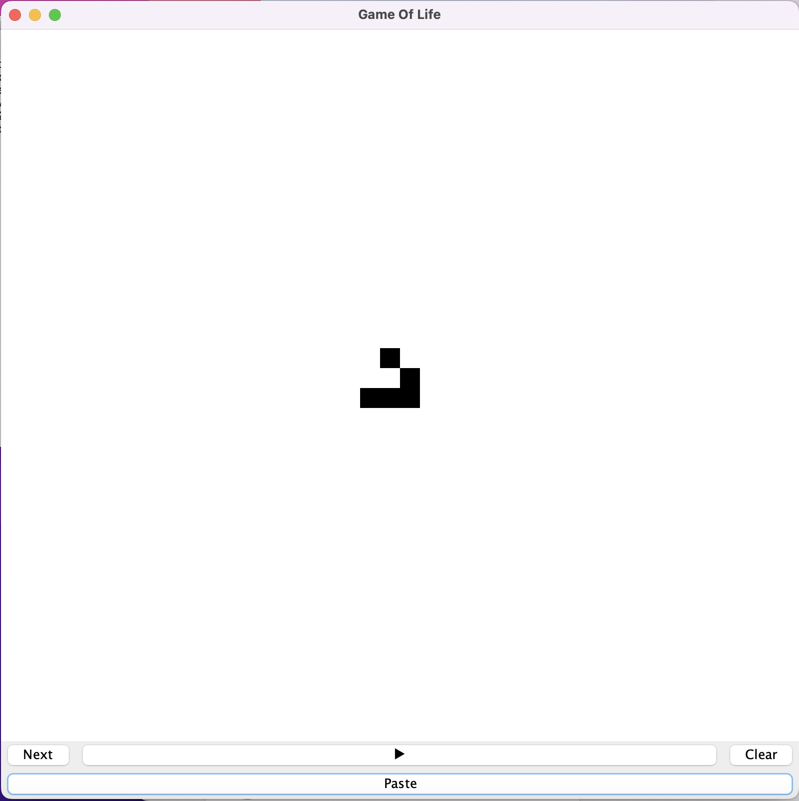

# Conway's Game of Life

Conway's Game of Life is a game where cells evolve according to its initial 
configuration. Players set up the initial state and watch how it evolves 
according to the specific rules. [Wiki](https://en.wikipedia.org/wiki/Conway%27s_Game_of_Life)

This game alows the player to paste either a file, url or plain text.
The "paste" button will copy what is on the clipboard and decode it to the desired pattern

